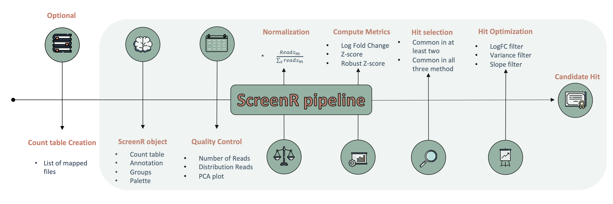

<!-- README.md is generated from README.Rmd. Please edit that file -->

# ScreenR <a href='https://emanuelsoda.github.io/ScreenR/'></a>

<!-- badges: start -->

[](https://codecov.io/gh/EmanuelSoda/ScreenR)
[](https://github.com/EmanuelSoda/ScreenR/issues)
[](https://github.com/EmanuelSoda/ScreenR/pulls)
[](https://github.com/EmanuelSoda/ScreenR/network/members)
[]()
[]()
[]()
[]()

<!-- badges: end -->

ScreenR is an easy and effective package to perform hits identification
in loss of function High Throughput Biological Screening performed with
shRNAs library. ScreenR combines the power of software like edgeR with
the simplicity of the Tidyverse metapackage. ScreenR executes a pipeline
able to find candidate hits from barcode counts data and integrates a
wide range of visualization for each step of the analysis

## Installation instructions

Get the latest stable `R` release from
[CRAN](http://cran.r-project.org/) note that you need to have `R 4.3` or
greater to use `ScreenR`. Then install `ScreenR` from
[Bioconductor](http://bioconductor.org/) using the following code:

``` r
if (!requireNamespace("BiocManager", quietly = TRUE)) {
    install.packages("BiocManager")
}

BiocManager::install("ScreenR")
```

And the development version from
[GitHub](https://github.com/EmanuelSoda/ScreenR) with:

``` r
devtools::install_github("EmanuelSoda/ScreenR")
```

## ScreenR overall workflow



## Citation
Below is the citation output from using `citation('ScreenR')` in R. Please run this yourself to check for any updates on how to cite **ScreenR**. 
```{r 'citation', eval = requireNamespace('ScreenR')}
print(citation('ScreenR'), bibtex = TRUE) 
```

Please note that the `ScreenR` was only made possible thanks to many
other R and bioinformatics software authors, which are cited either in
the vignettes and/or the paper(s) describing this package.


## Code of Conduct

Please note that the `ScreenR` project is released with a [Contributor
Code of Conduct](http://bioconductor.org/about/code-of-conduct/). By
contributing to this project, you agree to abide by its terms.

## Development tools

-   Continuous code testing is possible thanks to [GitHub
    actions](https://www.tidyverse.org/blog/2020/04/usethis-1-6-0/)
    through *[usethis](https://CRAN.R-project.org/package=usethis)*,
    *[remotes](https://CRAN.R-project.org/package=remotes)*, and
    *[rcmdcheck](https://CRAN.R-project.org/package=rcmdcheck)*
    customized to use [Bioconductor’s docker
    containers](https://www.bioconductor.org/help/docker/) and
    *[BiocCheck](https://bioconductor.org/packages/3.15/BiocCheck)*.
-   Code coverage assessment is possible thanks to
    [codecov](https://codecov.io/gh) and
    *[covr](https://CRAN.R-project.org/package=covr)*.
-   The [documentation website](http://EmanuelSoda.github.io/ScreenR) is
    automatically updated thanks to
    *[pkgdown](https://CRAN.R-project.org/package=pkgdown)*.
-   The code is styled automatically thanks to
    *[styler](https://CRAN.R-project.org/package=styler)*.
-   The documentation is formatted thanks to
    *[devtools](https://CRAN.R-project.org/package=devtools)* and
    *[roxygen2](https://CRAN.R-project.org/package=roxygen2)*.

For more details, check the `dev` directory.

This package was developed using
*[biocthis](https://bioconductor.org/packages/3.15/biocthis)*.
