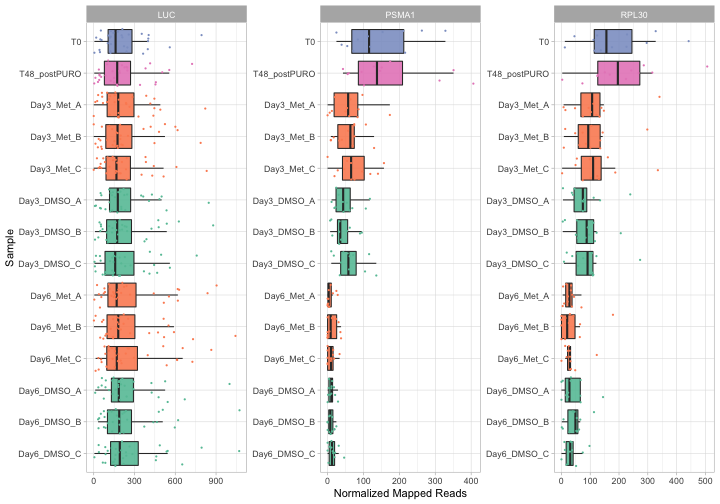

# Importing Pacakge

```r
library(ScreenR)
library(ggplot2)
library(dplyr)
library(tidyr)
theme_set(theme_light())
knitr::opts_chunk$set(fig.width=10, fig.height=7) 
```

# Read Data

We will use as example a Loss of Function Genetic Screening Performed on THP1
using Metforming at Day3 and Day6. First of all the data are read.

```r
data(CountTable_THP1_CONTROL_vs_MET)
data(Table_Annotation)

data <- tidyr::tibble(CountTable_THP1_CONTROL_vs_MET)
colnames(data) <- c(
    "Barcode", "T0", "T48_postPURO", "Day3_Met_A", "Day3_Met_B", "Day3_Met_C",
    "Day3_DMSO_A", "Day3_DMSO_B", "Day3_DMSO_C", "Day6_Met_A", "Day6_Met_B",
    "Day6_Met_C", "Day6_DMSO_A", "Day6_DMSO_B", "Day6_DMSO_C"
)
data <- data %>%
    dplyr::mutate(Barcode = as.factor(Barcode)) %>%
    dplyr::filter(Barcode != "*")


total_Annotation <- Table_Annotation %>%
    tibble::tibble() %>%
    dplyr::mutate(Barcode = as.factor(.$Barcode))
```

# Object Creation 
The ScreenR object is created using the function **create_screenR_object()**


```r
groups <- colnames(data)[2:length(colnames(data))]
groups <- gsub("(.*)_\\w+", "\\1", groups)
groups <- factor(x = groups, levels = unique(groups))
groups
```

```
##  [1] T0        T48       Day3_Met  Day3_Met  Day3_Met  Day3_DMSO Day3_DMSO
##  [8] Day3_DMSO Day6_Met  Day6_Met  Day6_Met  Day6_DMSO Day6_DMSO Day6_DMSO
## Levels: T0 T48 Day3_Met Day3_DMSO Day6_Met Day6_DMSO
```

```r
palette <- c(
    "#66c2a5", "#fc8d62", rep("#8da0cb", 3),
    rep("#e78ac3", 3),
    rep("#a6d854", 3),
    rep("#ffd92f", 3)
)

object <- create_screenR_object(
    table = data, annotation = total_Annotation, groups = groups,
    replicates = c("")
)
```


# Start Analysis

```r
object <- normalize_data(object)
object <- compute_data_table(object)
```


## Mapped Reads

```r
plot <- plot_mapped_reads(object, palette) + 
    ggplot2::coord_flip() +
    ggplot2::scale_y_continuous(labels = scales::number_format()) +
    ggplot2::theme(legend.position = "none") +
    ggplot2::ggtitle("Number of Mapped Reads in each sample")

plot
```


## Boxplot

```r
plot <- distribution_mapped_reads(
    object, palette, alpha = 0.8,
    type = "boxplot"
) +
    theme(
        legend.position = "none",
        axis.text.x = element_text(angle = 40, hjust = 1)
    )

plot
```


## Boxplot

```r
plot <- distribution_mapped_reads(
    object, palette, alpha = 0.5,
    type = "density"
) +
    ggplot2::theme(legend.position = "none")

plot
```


## Control Genes

```r
data_tmp <- slot(object = object, name = "data_table")
data_tmp %>%
    dplyr::filter(Gene %in% c("RPL30", "PSMA1", "LUC")) %>%
  
    ggplot(., aes(x=Sample, y=Frequency, fill=Treatment)) +
    geom_boxplot(alpha = 0.9, outlier.shape = NA) +
    geom_jitter(shape=16, size = 0.7, aes(colour = Treatment)) +
    scale_fill_manual(values = unique(palette)) +
    scale_color_manual(values =  unique(palette)) +
    scale_alpha_manual(values=c(1, 0.1)) +
    theme_light()  +
    ylab("Normalized Mapped Reads") +
    theme(axis.ticks = element_line(size = 0.3), 
            legend.position = "none", legend.direction = "horizontal")  +
    coord_flip()  +
    scale_x_discrete(limits = rev(unique(data_tmp$Sample))) +
    facet_wrap("Gene", scales = "free")
```




## Barcode Lost

```r
plot <- plot_barcode_lost(screenR_Object = object, palette = palette) +
    theme(
        legend.position = "none",
        axis.text.x = element_text(angle = 40, hjust = 1)
    )
plot
```


## Plot MDS {.tabset}

### For Sample

```r
plot_MDS(screenR_Object = object) 
```


### For Treatment

```r
GGgroups <- gsub(".*_", "", groups)

plot_MDS(
    screenR_Object = object,
    groups = factor(x = GGgroups, levels = unique(GGgroups))
)
```


### For Day

```r
GGgroups <- sub("_.*", "", groups)
plot_MDS(
    screenR_Object = object,
    groups = factor(x = GGgroups, levels = unique(GGgroups))
)
```


## Compute Metrics

```r
# 2DG
data_with_measure_Met <- list(
    Day3 = compute_metrics(
        object, control = "DMSO", treatment = "Met",
        day = "Day3"
    ),
    Day6 = compute_metrics(
        object, control = "DMSO", treatment = "Met",
        day = "Day6"
    )
)


plot_Zscore_distribution(data_with_measure_Met, alpha = 0.8)
```


## Z-score hit

```r
zscore_hit_Met <- list(
    Day3 = find_zscore_hit(
        table_treate_vs_control = data_with_measure_Met$Day3,
        number_barcode = 7, metric = "median"
    ),
    Day6 = find_zscore_hit(
        table_treate_vs_control = data_with_measure_Met$Day6,
        number_barcode = 7, metric = "median"
    )
)
zscore_hit_Met
```

```
## $Day3
## # A tibble: 30 × 2
##    Gene   numberOfBarcode
##    <fct>            <int>
##  1 ASF1A                8
##  2 BRD3                 8
##  3 CBX1                 8
##  4 CBX8                 9
##  5 CHST13               8
##  6 EED                  8
##  7 ENO3                 8
##  8 FBP2                 8
##  9 HDAC1                8
## 10 HERC3                9
## # … with 20 more rows
## 
## $Day6
## # A tibble: 30 × 2
##    Gene   numberOfBarcode
##    <fct>            <int>
##  1 ACOX2                9
##  2 BAZ1B                8
##  3 BAZ2B                8
##  4 BRD9                 8
##  5 CHAF1A               8
##  6 CLOCK                9
##  7 EP300                8
##  8 GPT                  8
##  9 H2AFV                9
## 10 HECTD3               9
## # … with 20 more rows
```


## CAMERA

```r
groupss <- c(
    rep("T0/T48", 4),
    as.character(groups[5:length(groups)])
)


matrix_model <- model.matrix(~0 + groups)
colnames(matrix_model) <- unique(groups)

camera_hit_Met <- list(
    Day3 = find_camera_hit(
        screenR_Object = object, matrix_model = matrix_model,
        contrast = "Day3_Met"
    ),
    Day6 = find_camera_hit(
        screenR_Object = object, matrix_model = matrix_model,
        contrast = "Day6_Met"
    )
)

camera_hit_Met
```

```
## $Day3
## # A tibble: 281 × 5
##    Gene    NGenes Direction PValue   FDR
##    <chr>    <dbl> <fct>      <dbl> <dbl>
##  1 INPP5E      10 Down      0.0131 0.522
##  2 LDHAL6B     10 Down      0.0189 0.674
##  3 CHD2        10 Down      0.0324 0.906
##  4 TRIM43B     10 Down      0.0414 0.906
##  5 TRIM9        9 Down      0.0447 0.906
##  6 TYMS         9 Down      0.0528 0.906
##  7 PDHA2       10 Down      0.0584 0.906
##  8 PRDM4       10 Down      0.0594 0.906
##  9 HUWE1       10 Down      0.0646 0.906
## 10 LUC         32 Down      0.0698 0.906
## # … with 271 more rows
## 
## $Day6
## # A tibble: 269 × 5
##    Gene    NGenes Direction PValue   FDR
##    <chr>    <dbl> <fct>      <dbl> <dbl>
##  1 INPP5E      10 Down      0.0131 0.779
##  2 LDHAL6B     10 Down      0.0201 0.941
##  3 CHD2        10 Down      0.0285 0.969
##  4 PDHA2       10 Down      0.0316 0.969
##  5 TRIM9        9 Down      0.0355 0.969
##  6 TYMS         9 Down      0.0370 0.969
##  7 TRIM62       9 Down      0.0437 0.969
##  8 TRIM43B     10 Down      0.0491 0.969
##  9 ME3         10 Down      0.0500 0.969
## 10 HUWE1       10 Down      0.0584 0.969
## # … with 259 more rows
```

## ROAST

```r
roast_hit_Met <- list(
    Day3 = find_roast_hit(
        screenR_Object = object, matrix_model = matrix_model,
        contrast = "Day3_Met"
    ),
    Day6 = find_roast_hit(
        screenR_Object = object, matrix_model = matrix_model,
        contrast = "Day6_Met"
    )
)

roast_hit_Met
```

```
## $Day3
## # A tibble: 534 × 9
##    Gene   NGenes PropDown PropUp Direction PValue    FDR PValue.Mixed FDR.Mixed
##    <chr>   <int>    <dbl>  <dbl> <fct>      <dbl>  <dbl>        <dbl>     <dbl>
##  1 LUC        32        1      0 Down      0.0001 0.0001       0.0001    0.0001
##  2 PSMA1      12        1      0 Down      0.0001 0.0001       0.0001    0.0001
##  3 RPL30      12        1      0 Down      0.0001 0.0001       0.0001    0.0001
##  4 SEPT5      10        1      0 Down      0.0001 0.0001       0.0001    0.0001
##  5 SEPT9      10        1      0 Down      0.0001 0.0001       0.0001    0.0001
##  6 ACAA1      10        1      0 Down      0.0001 0.0001       0.0001    0.0001
##  7 ACAA2      10        1      0 Down      0.0001 0.0001       0.0001    0.0001
##  8 ACACA      10        1      0 Down      0.0001 0.0001       0.0001    0.0001
##  9 ACACB      10        1      0 Down      0.0001 0.0001       0.0001    0.0001
## 10 ACAD11     10        1      0 Down      0.0001 0.0001       0.0001    0.0001
## # … with 524 more rows
## 
## $Day6
## # A tibble: 534 × 9
##    Gene   NGenes PropDown PropUp Direction PValue    FDR PValue.Mixed FDR.Mixed
##    <chr>   <int>    <dbl>  <dbl> <fct>      <dbl>  <dbl>        <dbl>     <dbl>
##  1 LUC        32        1      0 Down      0.0001 0.0001       0.0001    0.0001
##  2 PSMA1      12        1      0 Down      0.0001 0.0001       0.0001    0.0001
##  3 RPL30      12        1      0 Down      0.0001 0.0001       0.0001    0.0001
##  4 SEPT5      10        1      0 Down      0.0001 0.0001       0.0001    0.0001
##  5 SEPT9      10        1      0 Down      0.0001 0.0001       0.0001    0.0001
##  6 ACAA1      10        1      0 Down      0.0001 0.0001       0.0001    0.0001
##  7 ACAA2      10        1      0 Down      0.0001 0.0001       0.0001    0.0001
##  8 ACACA      10        1      0 Down      0.0001 0.0001       0.0001    0.0001
##  9 ACACB      10        1      0 Down      0.0001 0.0001       0.0001    0.0001
## 10 ACAD11     10        1      0 Down      0.0001 0.0001       0.0001    0.0001
## # … with 524 more rows
```


## Find Common Hit 

```r
common_hit_Met_at_least_2 <- list(
    Day3 = find_common_hit(
        zscore_hit_Met$Day3, camera_hit_Met$Day3, roast_hit_Met$Day3,
        common_in = 2
    ),
    Day6 = find_common_hit(
        zscore_hit_Met$Day6, camera_hit_Met$Day6, roast_hit_Met$Day6,
        common_in = 2
    )
)

common_hit_Met_at_least_3 <- list(
    Day3 = find_common_hit(
        zscore_hit_Met$Day3, camera_hit_Met$Day3, roast_hit_Met$Day3,
        common_in = 3
    ),
    Day6 = find_common_hit(
        zscore_hit_Met$Day6, camera_hit_Met$Day6, roast_hit_Met$Day6,
        common_in = 3
    )
)
```


```r
plot_common_hit(
    hit_zscore = zscore_hit_Met$Day3, hit_camera = camera_hit_Met$Day3,
    roast_hit_Met$Day3
)
```

```
## Warning in sprintf("%d", n, 100 * n/sum(n)): un argomento non usato per il
## formato '%d'
```


```r
sessionInfo()
```

```
## R version 4.1.2 (2021-11-01)
## Platform: x86_64-apple-darwin17.0 (64-bit)
## Running under: macOS Big Sur 10.16
## 
## Matrix products: default
## BLAS:   /Library/Frameworks/R.framework/Versions/4.1/Resources/lib/libRblas.0.dylib
## LAPACK: /Library/Frameworks/R.framework/Versions/4.1/Resources/lib/libRlapack.dylib
## 
## locale:
## [1] C/it_IT.UTF-8/it_IT.UTF-8/C/it_IT.UTF-8/it_IT.UTF-8
## 
## attached base packages:
## [1] stats     graphics  grDevices utils     datasets  methods   base     
## 
## other attached packages:
## [1] ggplot2_3.3.5  ScreenR_0.1.0  edgeR_3.36.0   limma_3.50.1   dplyr_1.0.8   
## [6] magrittr_2.0.2 tidyr_1.2.0   
## 
## loaded via a namespace (and not attached):
##  [1] Rcpp_1.0.8        locfit_1.5-9.4    lattice_0.20-45   prettyunits_1.1.1
##  [5] ps_1.6.0          assertthat_0.2.1  rprojroot_2.0.2   digest_0.6.29    
##  [9] utf8_1.2.2        R6_2.5.1          evaluate_0.15     highr_0.9        
## [13] pillar_1.7.0      rlang_1.0.1       rstudioapi_0.13   callr_3.7.0      
## [17] splines_4.1.2     desc_1.4.0        labeling_0.4.2    devtools_2.4.3   
## [21] stringr_1.4.0     munsell_0.5.0     compiler_4.1.2    xfun_0.29        
## [25] pkgconfig_2.0.3   pkgbuild_1.3.1    tidyselect_1.1.1  tibble_3.1.6     
## [29] roxygen2_7.1.2    ggvenn_0.1.9      fansi_1.0.2       crayon_1.5.0     
## [33] withr_2.4.3       brio_1.1.3        grid_4.1.2        gtable_0.3.0     
## [37] lifecycle_1.0.1   DBI_1.1.2         scales_1.1.1      cli_3.2.0        
## [41] stringi_1.7.6     cachem_1.0.6      farver_2.1.0      fs_1.5.2         
## [45] remotes_2.4.2     testthat_3.1.2    xml2_1.3.3        ellipsis_0.3.2   
## [49] generics_0.1.2    vctrs_0.3.8       tools_4.1.2       glue_1.6.1       
## [53] purrr_0.3.4       processx_3.5.2    pkgload_1.2.4     fastmap_1.1.0    
## [57] colorspace_2.0-3  sessioninfo_1.2.2 strex_1.4.2       memoise_2.0.1    
## [61] knitr_1.37        patchwork_1.1.1   usethis_2.1.5
```


<!-- ## Plot Barcode Hit -->
<!-- ```{r Barcode Hit, fig.height=7, fig.width=10, message=FALSE, 
warning=FALSE} -->
<!-- contrast_Day21_2DG <- makeContrasts(Day21_2DG-Day21_DMSO, 
levels=matrix_model) -->
<!-- plot_barcode_hit(screenR_Object = object, -->
<!--                  matrix_model = matrix_model, -->
<!--                  contrast = contrast_Day21_2DG, -->
<!--                  hit_common = common_hit_2DG_at_least_3$Day21, -->
<!--                  gene = "KDM1A") -->

<!-- plot_barcode_trend(list_data_measure = data_with_measure_2DG, -->
<!--                    genes = c("KDM1A"), -->
<!--                    n_col = 1,color = ggsci::pal_jco()(10))  -->

<!-- data_with_measure_2DG$Day21  %>% arrange(Log2FC) %>%  
filter(Gene == "KDM1A") -->

<!-- library(edgeR) -->
<!-- matrix <- -->
<!--   as.matrix(data[, 2: dim(data)[2]]) -->


<!-- rownames(matrix) <- data$Barcode -->

<!-- DGEList <- DGEList(counts = matrix, -->
<!--                    group = factor(groups), genes = total_Annotation) -->
<!-- xglm <- estimateDisp(DGEList, matrix_model) -->
<!-- fit <- glmFit(xglm, matrix_model) -->

<!-- contrast_Day21_2DG <- makeContrasts(Day21_2DG-Day21_DMSO, 
levels=matrix_model) -->
<!-- lrt_Day21_2DG <- glmLRT(fit, contrast = contrast_Day21_2DG) -->

<!-- genesymbols <- as.character(DGEList$genes[, 1]) -->
<!-- genesymbollist2 <- list() -->
<!-- unq <- unique(genesymbols) -->
<!-- unq <- unq[!is.na(unq)] -->
<!-- for(i in unq) { -->
<!--   sel <- genesymbols == i & !is.na(genesymbols) -->
<!--   if(sum(sel)>3) -->
<!--     genesymbollist2[[i]] <- which(sel) -->
<!-- } -->


<!-- barcodeplot(statistics = lrt_Day21_2DG$table$logFC, -->
<!--             index=genesymbollist2[["KDM1A"]], -->
<!--  main= paste("Day21: Barcode plot for Gene", "KDM1A", sep = " ") , -->
<!--  labels=c("Negative logFC", "Positive logFC"), -->
<!--  quantile=c(-0.5,0.5)) -->


<!-- prova <- object@annotation_table  %>%  -->
<!--   select(Gene, Barcode,Library) -->


<!-- prova <- prova %>%  -->
<!--   mutate(Barcode = as.numeric(Barcode))  %>%  -->
<!--   group_by(Gene) %>%  -->
<!--   split(.$Gene, .$Barcode)  -->

<!-- prova <- map(.x = prova,.f = function(x){x %>% pull(Barcode)}) -->

<!-- barcodeplot(lrt_Day21_2DG$table$logFC,index=prova[["KDM1A"]], -->
<!--  main= paste("Day21: Barcode plot for Gene", "KDM1A", sep = " ") , -->
<!--  labels=c("Negative logFC", "Positive logFC"), -->
<!--  quantile=c(-0.5,0.5)) -->

<!-- ``` -->


