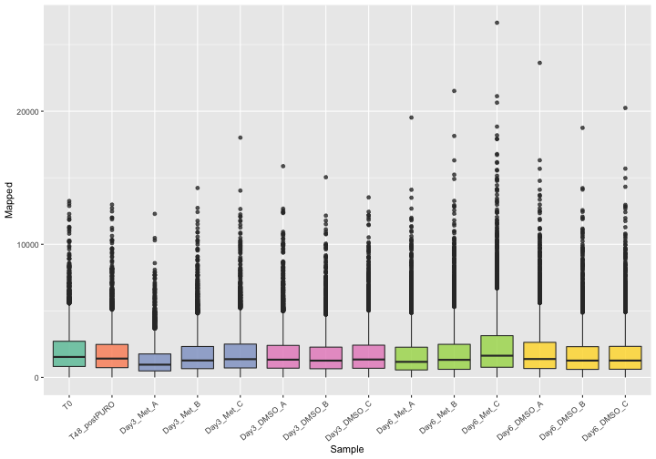
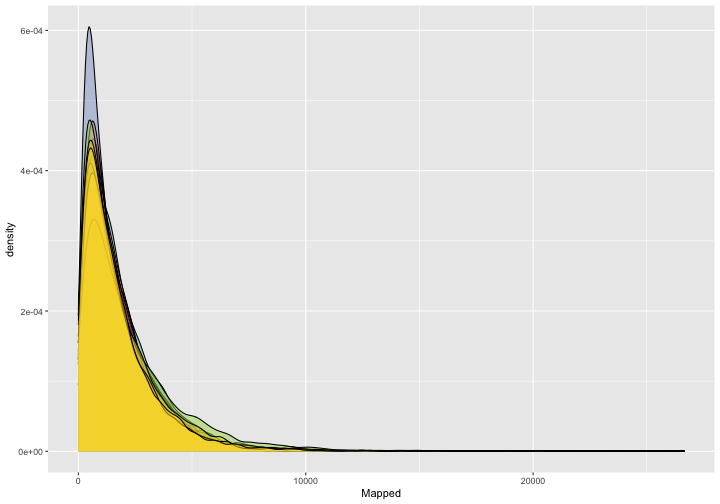
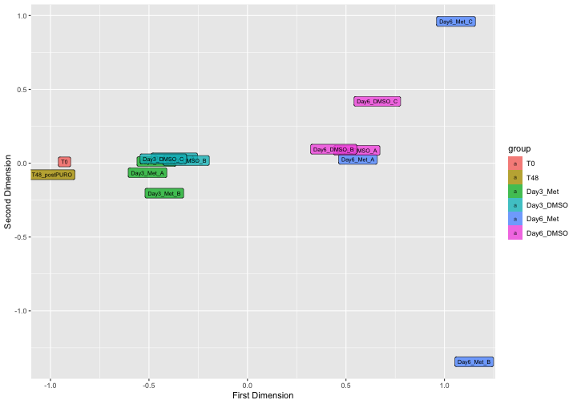
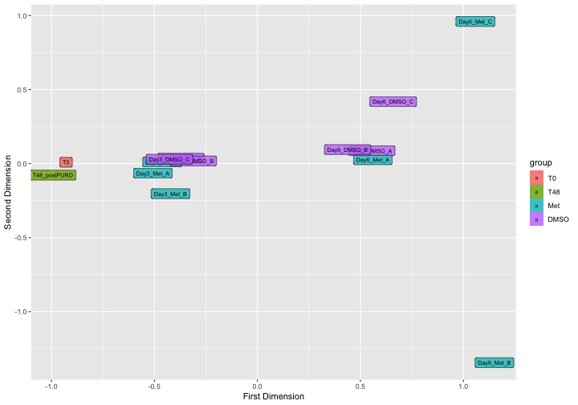
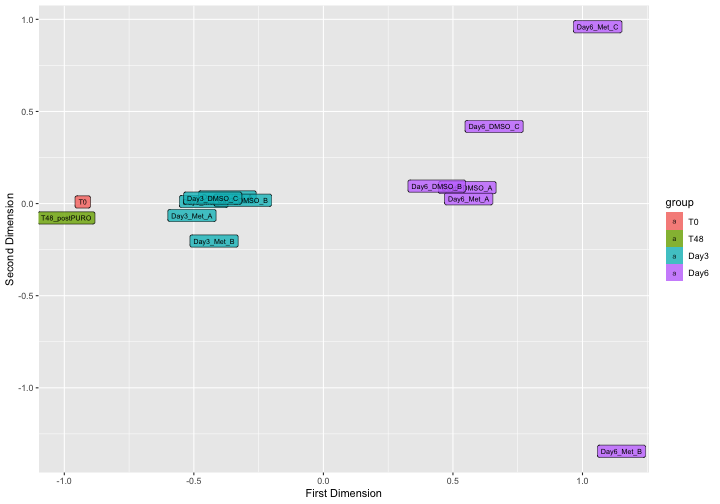

# Importing Pacakge

```r
library(ggplot2)
library(dplyr)
library(tidyr)
knitr::opts_chunk$set(fig.width=10, fig.height=7) 
```

# Introduction 
The R package **ScreenR** has been developed to perform the analysis of data 
coming from RNA-seq data generated using Genetic Screening. It is based 
on the same idea of edgeR but it also integrate the idea at the base of 
Tidyverse. 


# Analysis 
## Loading the package

After installation, loading the package is simple:

```r
library(ScreenR)
```

## Read Data
The input of ScreenR is a count table. A count table is usually the starting 
point  of an RNA-seq differentially expressed genes analysis and consists of
a matrix containing  reads count organized with: 

* Genes on the rows
* Samples on the columns

For this vignette we will use as an example a Loss of Function Genetic Screening
performed using . 
First of all the data has to be read.

```r
data(count_table)
data(annotation_table)

data <- count_table
colnames(data) <- c(
    "Barcode", "T1", "T2", "Time3_TRT_A", "Time3_TRT_B", "Time3_TRT_C",
    "Time3_A", "Time3_B", "Time3_C", "Time4_TRT_A", "Time4_TRT_B",
    "Time4_TRT_C", "Time4_A", "Time4_B", "Time4_c"
)
data <- data %>%
    dplyr::mutate(Barcode = as.factor(Barcode)) %>%
    dplyr::filter(Barcode != "*")


total_Annotation <-  annotation_table 
```

## Object Creation 
The second needed step is to create a **ScreenR object** from the count table.
The ScreenR object is created using the function **create_screenR_object()**.
This object will be used to store the most important information to perform 
the analysis. Most of the ScreenR function takes as main input the ScreenR 
object to perform the needed operation and return a result.


```r
groups <- colnames(data)[2:length(colnames(data))]
groups <- gsub("(.*)_\\w+", "\\1", groups)
groups <- factor(x = groups, levels = unique(groups))

palette <- c(
    "#66c2a5", "#fc8d62", rep("#8da0cb", 3),
    rep("#e78ac3", 3),
    rep("#a6d854", 3),
    rep("#ffd92f", 3)
)

object <- create_screenR_object(
    table = data, annotation = total_Annotation, groups = groups,
    replicates = c("")
)
```


## Computing the needed tables
In order to start the analysis the data has first to be normalized and the 
*data_table*.

For what concern the normalizzation ScreenR uses a normalizzation that is called
*Reads Per Million Sample (RPMS)* which has the following mathematical 
expression:

$$RPMS = \frac{Number \; of \; mapped \; reads \; to \; a \; barcode} 
                   { \sum_{sample}{Number\; of \;mapped \; reads}} *10^{6}$$ 
                   
The number of reads mapped for each Barcode in a sample are normalized by the 
number of reads in that sample and multiplied by one million.
Then has to be computed the *data_table*. The *data_table* can be seen as a 
tidy version of the original *count table* and will be used throughout the 
analysis.

```r
object <- normalize_data(object)
object <- compute_data_table(object)
```


## Mapped Reads

```r
plot <- plot_mapped_reads(object, palette) + 
    ggplot2::coord_flip() +
    ggplot2::scale_y_continuous(labels = scales::number_format()) +
    ggplot2::theme(legend.position = "none") +
    ggplot2::ggtitle("Number of Mapped Reads in each sample")

plot
```


## Quality Check 
The first step to perform when dealing with RNA-seq data is to check the 
quality of the samples. In ScreenR this can be done using several methods.
For example the distribution can be seen using both boxplots or density plots.

### Boxplot Mapped Reads

```r
plot <- distribution_mapped_reads(
    object, palette, alpha = 0.8,
    type = "boxplot"
) +
    theme(
        legend.position = "none",
        axis.text.x = element_text(angle = 40, hjust = 1)
    )

plot
```



### Density plot

```r
plot <- distribution_mapped_reads(
    object, palette, alpha = 0.5,
    type = "density"
) +
    ggplot2::theme(legend.position = "none")

plot
```




### Barcode Lost

Moreover another very important quality check when a Genetic Screening is 
performed is to check the barcode lost during the experiment. ScreenR implements
a function able to  compute and plot the number of barcodes lost. 

```r
plot <- plot_barcode_lost(screenR_Object = object, palette = palette) +
    theme(
        legend.position = "none",
        axis.text.x = element_text(angle = 40, hjust = 1)
    )
plot
```


### Plot MDS {.tabset}
In order to see compare the samples an initial MDS analysis can be conducted.
In ScreenR this can be done using the *plot_MDS* function as follow.

#### For Sample

```r
plot_MDS(screenR_Object = object) 
```




#### For Treatment

```r
GGgroups <- gsub(".*_", "", groups)

plot_MDS(
    screenR_Object = object,
    groups = factor(x = GGgroups, levels = unique(GGgroups))
)
```



#### For Day

```r
GGgroups <- sub("_.*", "", groups)
plot_MDS(
    screenR_Object = object,
    groups = factor(x = GGgroups, levels = unique(GGgroups))
)
```



## Statistical Analysis
Finally can be conducted the real analysis. 
The statistical Analysis is based on three methods:

* Z-score filtering
* CAMERA filtering 
* ROAST filtering 

### Compute Metrics
In order to compute the Z-score, first a list of metrics has to be computed. 
In particular a *Log2FC* is computed for the treated vs control samples in the 
different conditions. Here for example a treated vs control in different day 
is computed. Then the different distribution of the Z-score can be plotted 
using the *plot_Zscore_distribution* function. 


```r
# 2DG
data_with_measure_TRT <- list(
    Time3 = compute_metrics(
        object, control = "Time3", treatment = "TRT",
        day = "Time3"
    ),
    Time4 = compute_metrics(
        object, control = "Time4", treatment = "TRT",
        day = "Time4"
    )
)


plot_Zscore_distribution(data_with_measure_TRT, alpha = 0.8)
```


### Z-score hit
Now that the metrics has been computed the hits according to Z-score can be 
found. This in ScreenR is done using the *find_zscore_hit* function.


```r
zscore_hit_TRT <- list(
    Time3 = find_zscore_hit(
        table_treate_vs_control = data_with_measure_TRT$Time3,
        number_barcode = 7, metric = "median"
    ),
    Time4 = find_zscore_hit(
        table_treate_vs_control = data_with_measure_TRT$Time4,
        number_barcode = 7, metric = "median"
    )
)
zscore_hit_TRT
```

```
## $Time3
## # A tibble: 30 × 2
##    Gene     numberOfBarcode
##    <chr>              <int>
##  1 Gene_116               8
##  2 Gene_120               8
##  3 Gene_128               8
##  4 Gene_156               8
##  5 Gene_173               9
##  6 Gene_190               8
##  7 Gene_193               8
##  8 Gene_200               8
##  9 Gene_218               8
## 10 Gene_226               8
## # … with 20 more rows
## 
## $Time4
## # A tibble: 30 × 2
##    Gene     numberOfBarcode
##    <chr>              <int>
##  1 Gene_121               8
##  2 Gene_147               8
##  3 Gene_148               9
##  4 Gene_15                9
##  5 Gene_168               9
##  6 Gene_171               9
##  7 Gene_173               8
##  8 Gene_185               8
##  9 Gene_204               8
## 10 Gene_245              18
## # … with 20 more rows
```


### CAMERA
The same can be done with the CAMERA hit using the function  *find_camera_hit*.

```r
matrix_model <- model.matrix(~0 + groups)
colnames(matrix_model) <- unique(groups)

camera_hit_TRT <- list(
    Time3 = find_camera_hit(
        screenR_Object = object, matrix_model = matrix_model,
        contrast = "Time3_TRT"
    ),
    Time4 = find_camera_hit(
        screenR_Object = object, matrix_model = matrix_model,
        contrast = "Time4_TRT"
    )
)

camera_hit_TRT
```

```
## $Time3
## # A tibble: 281 × 5
##    Gene     NGenes Direction PValue   FDR
##    <chr>     <dbl> <fct>      <dbl> <dbl>
##  1 Gene_199     10 Down      0.0131 0.522
##  2 Gene_239     10 Down      0.0189 0.674
##  3 Gene_78      10 Down      0.0324 0.906
##  4 Gene_478     10 Down      0.0414 0.906
##  5 Gene_508      9 Down      0.0447 0.906
##  6 Gene_516      9 Down      0.0528 0.906
##  7 Gene_298     10 Down      0.0584 0.906
##  8 Gene_347     10 Down      0.0594 0.906
##  9 Gene_183     10 Down      0.0646 0.906
## 10 Gene_245     32 Down      0.0698 0.906
## # … with 271 more rows
## 
## $Time4
## # A tibble: 269 × 5
##    Gene     NGenes Direction PValue   FDR
##    <chr>     <dbl> <fct>      <dbl> <dbl>
##  1 Gene_199     10 Down      0.0131 0.779
##  2 Gene_239     10 Down      0.0201 0.941
##  3 Gene_78      10 Down      0.0285 0.969
##  4 Gene_298     10 Down      0.0316 0.969
##  5 Gene_508      9 Down      0.0355 0.969
##  6 Gene_516      9 Down      0.0370 0.969
##  7 Gene_494      9 Down      0.0437 0.969
##  8 Gene_478     10 Down      0.0491 0.969
##  9 Gene_257     10 Down      0.0500 0.969
## 10 Gene_183     10 Down      0.0584 0.969
## # … with 259 more rows
```

### ROAST
Last but not least this is done also for the ROAST hit using the function  
*find_roast_hit*.

```r
roast_hit_TRT <- list(
    Time3 = find_roast_hit(
        screenR_Object = object, matrix_model = matrix_model,
        contrast = "Time3_TRT"
    ),
    Time4 = find_roast_hit(
        screenR_Object = object, matrix_model = matrix_model,
        contrast = "Time4_TRT"
    )
)

roast_hit_TRT
```

```
## $Time3
## # A tibble: 534 × 9
##    Gene     NGenes PropDown PropUp Direction PValue   FDR PValue.Mixed FDR.Mixed
##    <chr>     <int>    <dbl>  <dbl> <fct>      <dbl> <dbl>        <dbl>     <dbl>
##  1 Gene_245     32        1      0 Down      0.0001  1e-4       0.0001    0.0001
##  2 Gene_364     12        1      0 Down      0.0001  1e-4       0.0001    0.0001
##  3 Gene_372     12        1      0 Down      0.0001  1e-4       0.0001    0.0001
##  4 Gene_380     10        1      0 Down      0.0001  1e-4       0.0001    0.0001
##  5 Gene_381     10        1      0 Down      0.0001  1e-4       0.0001    0.0001
##  6 Gene_1       10        1      0 Down      0.0001  1e-4       0.0001    0.0001
##  7 Gene_2       10        1      0 Down      0.0001  1e-4       0.0001    0.0001
##  8 Gene_3       10        1      0 Down      0.0001  1e-4       0.0001    0.0001
##  9 Gene_4       10        1      0 Down      0.0001  1e-4       0.0001    0.0001
## 10 Gene_5       10        1      0 Down      0.0001  1e-4       0.0001    0.0001
## # … with 524 more rows
## 
## $Time4
## # A tibble: 534 × 9
##    Gene     NGenes PropDown PropUp Direction PValue   FDR PValue.Mixed FDR.Mixed
##    <chr>     <int>    <dbl>  <dbl> <fct>      <dbl> <dbl>        <dbl>     <dbl>
##  1 Gene_245     32        1      0 Down      0.0001  1e-4       0.0001    0.0001
##  2 Gene_364     12        1      0 Down      0.0001  1e-4       0.0001    0.0001
##  3 Gene_372     12        1      0 Down      0.0001  1e-4       0.0001    0.0001
##  4 Gene_380     10        1      0 Down      0.0001  1e-4       0.0001    0.0001
##  5 Gene_381     10        1      0 Down      0.0001  1e-4       0.0001    0.0001
##  6 Gene_1       10        1      0 Down      0.0001  1e-4       0.0001    0.0001
##  7 Gene_2       10        1      0 Down      0.0001  1e-4       0.0001    0.0001
##  8 Gene_3       10        1      0 Down      0.0001  1e-4       0.0001    0.0001
##  9 Gene_4       10        1      0 Down      0.0001  1e-4       0.0001    0.0001
## 10 Gene_5       10        1      0 Down      0.0001  1e-4       0.0001    0.0001
## # … with 524 more rows
```


### Find Common Hit 
ScreenR consider as final hit only the one present in common among the three 
methods. In particular two strategy are possible:

* Are considered candidate Hits the one present in at least two of the three 
methods
* Are considered candidate Hits the one present in all of the three methods


```r
common_hit_TRT_at_least_2 <- list(
    Time3 = find_common_hit(
        zscore_hit_TRT$Time3, camera_hit_TRT$Time3, roast_hit_TRT$Day3,
        common_in = 2
    ),
    Time4 = find_common_hit(
        zscore_hit_TRT$Time4, camera_hit_TRT$Time4, roast_hit_TRT$Day6,
        common_in = 2
    )
)

common_hit_TRT_at_least_3 <- list(
    Time3 = find_common_hit(
        zscore_hit_TRT$Time3, camera_hit_TRT$Time3, roast_hit_TRT$Time3,
        common_in = 3
    ),
    Time4 = find_common_hit(
        zscore_hit_TRT$Time4, camera_hit_TRT$Time4, roast_hit_TRT$Time4,
        common_in = 3
    )
)
```


### Plot common hit

The hits can be easily visualized using the *plot_common_hit* function.


```r
plot_common_hit(
    hit_zscore = zscore_hit_TRT$Time3, hit_camera = camera_hit_TRT$Time3,
    roast_hit_TRT$Time3
)
```

```
## Warning in sprintf("%d", n, 100 * n/sum(n)): one argument not used by format
## '%d'
```


```r
sessionInfo()
```

```
## R version 4.1.2 (2021-11-01)
## Platform: x86_64-apple-darwin17.0 (64-bit)
## Running under: macOS Big Sur 10.16
## 
## Matrix products: default
## BLAS:   /Library/Frameworks/R.framework/Versions/4.1/Resources/lib/libRblas.0.dylib
## LAPACK: /Library/Frameworks/R.framework/Versions/4.1/Resources/lib/libRlapack.dylib
## 
## locale:
## [1] C/en_US.UTF-8/en_US.UTF-8/C/en_US.UTF-8/en_US.UTF-8
## 
## attached base packages:
## [1] stats     graphics  grDevices utils     datasets  methods   base     
## 
## other attached packages:
## [1] tidyr_1.2.0    dplyr_1.0.8    ggplot2_3.3.5  ScreenR_0.99.4
## 
## loaded via a namespace (and not attached):
##  [1] Rcpp_1.0.8.3      locfit_1.5-9.5    lattice_0.20-45   prettyunits_1.1.1
##  [5] ps_1.6.0          assertthat_0.2.1  rprojroot_2.0.3   digest_0.6.29    
##  [9] utf8_1.2.2        R6_2.5.1          evaluate_0.15     highr_0.9        
## [13] pillar_1.7.0      rlang_1.0.2       rstudioapi_0.13   callr_3.7.0      
## [17] splines_4.1.2     desc_1.4.1        labeling_0.4.2    devtools_2.4.3   
## [21] stringr_1.4.0     munsell_0.5.0     compiler_4.1.2    xfun_0.30        
## [25] pkgconfig_2.0.3   pkgbuild_1.3.1    tidyselect_1.1.2  tibble_3.1.6     
## [29] roxygen2_7.1.2    ggvenn_0.1.9      edgeR_3.36.0      fansi_1.0.3      
## [33] crayon_1.5.1      withr_2.5.0       brio_1.1.3        grid_4.1.2       
## [37] gtable_0.3.0      lifecycle_1.0.1   DBI_1.1.2         magrittr_2.0.3   
## [41] scales_1.1.1      cli_3.2.0         stringi_1.7.6     cachem_1.0.6     
## [45] farver_2.1.0      fs_1.5.2          remotes_2.4.2     testthat_3.1.3   
## [49] limma_3.50.1      xml2_1.3.3        ellipsis_0.3.2    generics_0.1.2   
## [53] vctrs_0.4.0       tools_4.1.2       glue_1.6.2        purrr_0.3.4      
## [57] processx_3.5.3    pkgload_1.2.4     fastmap_1.1.0     colorspace_2.0-3 
## [61] sessioninfo_1.2.2 strex_1.4.2       memoise_2.0.1     knitr_1.38       
## [65] patchwork_1.1.1   usethis_2.1.5
```


